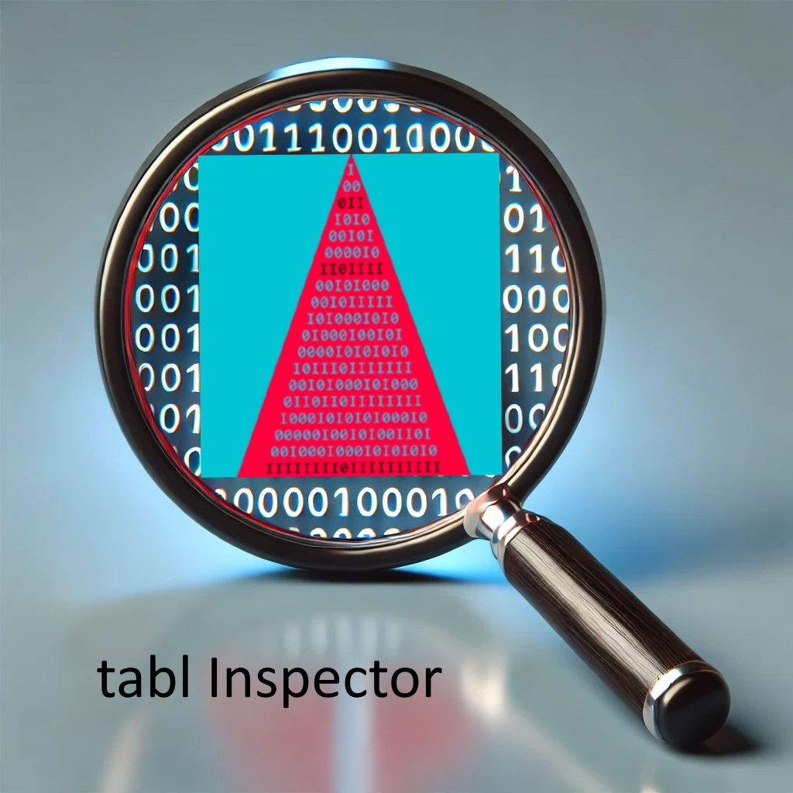

# tablInspector

No, the name has no typo. 'tabl' is a keyword in the Online Encyclopedia of Integer Sequences (OEIS). It classifies a sequence as a regular triangular array of numbers.

The goal of this library is to identify semantically meaningful clusters around integer triangles, to implement these triangles, and to provide tools to study them.

The implementations are written in annotated Python and refer to a uniform interface.

An integer triangle is a list of integer lists (list[list[int]]). As usual in Python, all lists are 0-based; in particular, all triangles have offset = 0.

This allows us to identify an integer triangle with a list whose indexing is like this:

```
[ [(0,0)], [(1,0), (1,1)], [(2,0), (2,1), (2,2)], ..., [(n,0), (n,1), ... (n,k), ... (n,n)] ]
```

For example, G. W. Leibniz wrote down a number triangle in his "Dissertatio de arte combinatoria", Leipzig in 1666, that we will display like this:

```
    [0]    [0]
    [1]    [0,   1]
    [2]    [0,   2,    2]
    [3]    [0,   3,    4,   3]
    [4]    [0,   4,    6,   6,    4]
    [5]    [0,   5,    8,   9,    8,    5]
    [6]    [0,   6,   10,  12,   12,   10,    6]
    [7]    [0,   7,   12,  15,   16,   15,   12,    7]
    [8]    [0,   8,   14,  18,   20,   20,   18,   14,   8]
    [9]    [0,   9,   16,  21,   24,   25,   24,   21,  16,  9]
```

The first (left) column indicates the row number and is not part of the triangle.

To use the library, put the file Tables.py in the same directory where your project is or somewhere else where the interpreter can find it. 
Make sure your Python has the "more_itertools" package installed. The other Python files are not needed as long as you do not want to make your own additions to the library.

Test the installation.

 ### Example 1

```
    from Tables import TablesListPreview
    TablesListPreview()
```

This shows the list of the sequences implemented.

To use a Table from the library:

 ### Example 2

```
    from Tables import Abel, InspectTable
    InspectTable(Abel)
```

Use the Table as an iterable:

### Example 3

```
    AbelRows = Abel.itr(7)
    for row in AbelRows:
        print(row, 'sum:', sum(row))
```

### ... or add your own table:

Go to the file "Template.py". It describes how you can add your own Table class to the library in three simple steps.

# The methods

Currently, 116 triangles are included in this library implementing the class `Table` that provides the following methods:

```
    __call__(self, n: int, k: int) -> int | T(n, k)
    val (n:int, k:int)   -> int  | T(n, k)
    row (n: int)         -> tblrow | n-th row of table
    itr (size: int)      -> Iterator[list[int]] | traverse the first 'size' rows
    flat (size: int)     -> list[int] | flattened form of the first size rows
    diag(n, size: int)   -> list[int] | diagonal starting at the left side
    col (k, size: int)   -> list[int] | k-th column starting at the main diagonal
    sum (size: int)      -> list[int] | sums of the first size rows
    antidiag (size: int) -> list[int] | upward anti-diagonals
    rev (size: int)      -> tblrow | reversed rows
    acc (size: int)      -> tblrow | accumulated row 
    alt (size: int)      -> tblrow | alternating signs 
    diff (size: int)     -> tblrow | first difference of row
    der (size: int)      -> tblrow | derivative of row
    tab (size: int)      -> tabl | table with size rows
    mat (size: int)      -> tabl | matrix form of lower triangular array
    inv (size: int)      -> tabl | inverse table
    revinv (size: int)   -> tabl | row reversed inverse
    invrev (size: int)   -> tabl | inverse of row reversed
    off (N: int, K: int) -> rowgen | new offset (N, K)
    revinv11 (size: int) -> tabl | revinv from offset (1, 1)
    invrev11 (size: int) -> tabl | invrev from offset (1, 1)
    poly(n: int, x: int) -> int  | sum(T(n, k) * x^j for j=0..n)
    trans(s: seq, size)  -> list[int] | linear transformation induced by T
    invtrans(s: seq, size) -> list[int] | inverse transformation induced by T
    show (size: int)     -> None | prints the first 'size' rows with row-numbers
```

These methods provide various functionalities for manipulating and generating integer triangles.
For example, the row method returns the n-th row of the triangle, the rev method returns 
the reversed row of the triangle, and the antidiag method returns the n-th antidiagonal of the triangle.


# Triangles as semantically meaningful clusters in the database.

This project aimed to identify the crucial triangles without relying on subjective assessment. 
For this, a metric had to be developed. We based the ranking on the number of distinct sequences 
generated by a fixed pool of elementary transformations mapping the triangles to other sequences. 
These transformations are called 'table traits' and are implemented in the module '_tabltraits'. 
These are very simple transformations that occur everywhere in the OEIS, but are not always 
recognized as such and then often lead to unnecessarily complicated formulas.

In the table below, the two columns on the right are _examples_ of thousands of similar identities that can be generated with the module.
Note: References to OEIS-Ids are approximate. They often differ in signs and offset, sometimes also in the first few values. 

| Name         |  Formula | Triangle   | Trait  |
| :---         | :---     | :---       | :---   |
| Triangle     | $ T_{n,k} $ | Abel  |  A137452 |
| Tinv         | $ (T^{-1})_{n,k} $ | Abel  | A059297  |
| Trev         | $ T_{n,n-k} $ | StirlingSet | A106800  |
| Tinvrev      | $ (T_{n,n-k})^{-1} $ | FallingFactorial | A132013  |
| Trevinv      | $ (T^{-1})_{n,n-k} $ | DyckPaths | A054142 |
| Toff11       | $ T_{n+1,k+1}  $ | StirlingSet  | A008277  |
| Trev11       | $ T_{n+1,n-k+1}  $ | Eulerian  | A008292  |
| Tinv11       | $ (T^{-1})_{n+1,k+1} $ | Eulerian  | A055325  |
| Tinvrev11    | $ (T_{n+1,n-k+1})^{-1} $ | Eulerian  | A055325  |
| Trevinv11    | $ (T^{-1})_{n+1,n-k+1} $ | StirlingSet  | A094638  |
| Tantidiag    | $ T_{n-k,k}\ \ (k \le n/2) $ | Motzkin  | A106489  |
| Tacc         | $ \sum_{j=0}^{k} T_{n,j} $ | Binomial | A008949  |
| Talt         | $ T_{n,k} (-1)^{k} $  | Binomial |  A130595 |
| Tder         | $ T_{n,k+1}\ (k+1)  $ | Abel | A225465 |
| TablCol0     | $ T_{n  ,0} $ | WardCycle | A000007 |
| TablCol1     | $ T_{n+1,1} $ | WardCycle | A000142 |
| TablCol2     | $ T_{n+2,2} $ | WardCycle | A000276 |
| TablCol3     | $ T_{n+3,3} $ | WardCycle | A000483 |
| TablDiag0    | $ T_{n  ,n} $ | WardSet | A001147 |
| TablDiag1    | $ T_{n+1,n} $ | WardSet | A000457 |
| TablDiag2    | $ T_{n+2,n} $ | WardSet | A000497 |
| TablDiag3    | $ T_{n+3,n} $ | WardSet | A000504 |
| TablLcm      | $ \text{lcm} \{ \ \| T_{n,k} \| : k=0..n \} $ | Binomial | A002944 |
| TablGcd      | $ \text{gcd} \{ \ \| T_{n,k} \| : k=0..n \} $ | Fubini | A141056 |
| TablMax      | $ \text{max} \{ \ \| T_{n,k} \| : k=0..n \} $ | BinaryPell  | A109388  |
| TablSum      | $ \sum_{k=0}^{n} T_{n,k} $ | Binomial | A000079  |
| EvenSum      | $ \sum_{k=0}^{n} T_{n,k}\ (2 \mid k) $ | Binomial | A011782  |
| OddSum       | $ \sum_{k=0}^{n} T_{n,k}\ (1 - (2 \mid k)) $ | Binomial | A131577  |
| AltSum       | $ \sum_{k=0}^{n} T_{n,k} (-1)^{k} $ | Binomial | A000007  |
| AbsSum       | $ \sum_{k=0}^{n} \| T_{n,k} \| $ | EulerTan | A009739  |
| AccSum       | $ \sum_{k=0}^{n} \sum_{j=0}^{k} T_{n,j} $ | Binomial | A001792  |
| AccRevSum    | $ \sum_{k=0}^{n} \sum_{j=0}^{k} T_{n,n-j} $ | StirlingCycle | A000774 |
| AntiDSum     | $ \sum_{k=0}^{n/2} T_{n-k, k} $ | Binomial | A000045 |
| ColMiddle    | $ T_{n, n / 2} $ | Binomial | A001405  |
| CentralE     | $ T_{2 n, n} $ | Binomial | A000984  |
| CentralO     | $ T_{2 n + 1, n} $ | Binomial | A001700  |
| PosHalf      | $ \sum_{k=0}^{n}T_{n,k}\ 2^{n-k}  $ | FallingFactorial | A010842  |
| NegHalf      | $ \sum_{k=0}^{n}T_{n,k}\ (-2)^{n-k}  $ | FallingFactorial | A000023  |
| TransNat0    | $ \sum_{k=0}^{n}T_{n,k}\ k $ | Binomial | A001787  |
| TransNat1    | $ \sum_{k=0}^{n}T_{n,k}\ (k+1) $ | Binomial | A001792  |
| TransSqrs    | $ \sum_{k=0}^{n}T_{n,k}\ k^{2} $ | Lah | A103194  |
| BinConv      | $ \sum_{k=0}^{n}T_{n,k}\ \binom{n}{k}  $ | FallingFactorial | A002720  |
| InvBinConv   | $ \sum_{k=0}^{n}T_{n,k}\ (-1)^{n-k}\ \binom{n}{k} $ | FallingFactorial | A009940  |
| PolyRow1     | $ \sum_{k=0}^{1}T_{1,k}\ n^k $ | Lucas | A005408 |
| PolyRow2     | $ \sum_{k=0}^{2}T_{2,k}\ n^k $ | Lucas | A000384 |
| PolyRow3     | $ \sum_{k=0}^{3}T_{3,k}\ n^k $ | Lucas | A015237 |
| PolyCol2     | $ \sum_{k=0}^{n}T_{n,k}\ 2^k $ | Abel | A007334 |
| PolyCol3     | $ \sum_{k=0}^{n}T_{n,k}\ 3^k $ | Abel | A362354 |
| PolyDiag     | $ \sum_{k=0}^{n}T_{n,k}\ n^k $ | Abel | A193678 |

In Visual Studio Code, the TeX formulas are displayed correctly in the preview.

# Looking up the traits in the OEIS

The module provides a central function that extracts the traits from tables and simultaneously searches for further information in the OEIS database. In particular, the function returns the A-number of the sequence, provided it is in the database.

    def LookUp(t: Table, tr: Trait, info: bool = True) -> int:
        """
        Look up the A-number in the OEIS database based on a trait of a table.

        Args:
            t (Table): The table to be analyzed.
            tr (Trait): A function that extracts a trait from the table.
            info (bool, optional): If True, information about the matching 
                                   will be displayed. Defaults to True.

        Returns:
            int: The A-number of the sequence if found, otherwise 0.
    
        Raises:
            Exception: If the OEIS server cannot be reached after multiple attempts.
            Currently, the function will return -999999 if the OEIS server cannot be reached.
    
        Example:
            >>> LookUp(Fubini, PolyDiag)
            If info = False then the function returns 94420.
            Otherwise it additionally displays information about the matching:
            You searched: 1,1,10,219,8676,...
            OEIS-data is: 1,1,10,219,8676,...
            Info: Starting at index 0 the next 13 consecutive terms match.
            The matched substring starts at 0 and has length 135.
            *** Found: A094420 Generalized ordered Bell numbers Bo(n,n).
        """

With currently 70 implemented traits and 100 triangles, right out of the box 7000 queries can be made in this way. This not only systematically links the triangles with sequences to a network, but often reveals previously unnoticed connections.


# Ranking of triangles.

In this way, we found that each of the 50 most highly ranked triangles generates, 
on average, 35 distinct related sequences registered in the OEIS. Thus, a high rank
means the triangle is a significant structural component in the OEIS database and binds
seemingly unrelated sequences into a semantically meaningful cluster. 

Currently, 118 triangles are included in this ranking. The top 50 triangles are listed below. (Note that some links are not yet implemented.)


|   | Name             |  OEIS |Distinct| Hits | Traits | Links |
| :-: | :---           | :---:  | :---:   |  :---: |  :---:  |  :---: |
|  1| StirlingSet       |A048993|  53    | 63| [All](https://peterluschny.github.io/tabl/StirlingSet.html)   | [OEIS](https://peterluschny.github.io/tablInspector/StirlingSetTraits.html) |
|  2| FallingFactorial       |A008279|  48    | 60| [All](https://peterluschny.github.io/tabl/FallingFactorial.html)   | [OEIS](https://peterluschny.github.io/tablInspector/FallingFactorialTraits.html) | 
|  3| StirlingCycle       |A132393|  47    | 63| [All](https://peterluschny.github.io/tabl/StirlingCycle.html)   | [OEIS](https://peterluschny.github.io/tablInspector/StirlingCycleTraits.html) |
|  4| BinaryPell       |A038207|  46    | 57| [All](https://peterluschny.github.io/tabl/BinaryPell.html)   | [OEIS](https://peterluschny.github.io/tablInspector/BinaryPellTraits.html) |
|  5| Lah       |A271703|  46    | 56| [All](https://peterluschny.github.io/tabl/Lah.html)   | [OEIS](https://peterluschny.github.io/tablInspector/LahTraits.html) |
|  6| Lucas       |A029635|  45    | 59| [All](https://peterluschny.github.io/tabl/Lucas.html)   | [OEIS](https://peterluschny.github.io/tablInspector/LucasTraits.html) |
|  7| DyckPathsInv       |A085478|  43    | 55| [All](https://peterluschny.github.io/tabl/DyckPathsInv.html)   | [OEIS](https://peterluschny.github.io/tablInspector/DyckPathsInvTraits.html) |
|  8| Fubini       |A131689|  43    | 50| [All](https://peterluschny.github.io/tabl/Fubini.html)   | [OEIS](https://peterluschny.github.io/tablInspector/FubiniTraits.html) |
|  9| Partition       |A072233|  43    | 55| [All](https://peterluschny.github.io/tabl/Partition.html)   | [OEIS](https://peterluschny.github.io/tablInspector/PartitionTraits.html) |
| 10| CatalanInv       |A128908|  42    | 49| [All](https://peterluschny.github.io/tabl/CatalanInv.html)   | [OEIS](https://peterluschny.github.io/tablInspector/CatalanInvTraits.html) |
| 11| BesselInv       |A122848|  41    | 48| [All](https://peterluschny.github.io/tabl/BesselInv.html)   | [OEIS](https://peterluschny.github.io/tablInspector/BesselInvTraits.html) |
| 12| Ordinals       |A002262|  41    | 66| [All](https://peterluschny.github.io/tabl/Ordinals.html)   | [OEIS](https://peterluschny.github.io/tablInspector/OrdinalsTraits.html) |
| 13| DyckPaths       |A039599|  39    | 51| [All](https://peterluschny.github.io/tabl/DyckPaths.html)   | [OEIS](https://peterluschny.github.io/tablInspector/DyckPathsTraits.html) |
| 14| Powers       |A004248|  39    | 49| [All](https://peterluschny.github.io/tabl/Powers.html)   | [OEIS](https://peterluschny.github.io/tablInspector/PowersTraits.html) |
| 15| Motzkin       |A064189|  38    | 48| [All](https://peterluschny.github.io/tabl/Motzkin.html)   | [OEIS](https://peterluschny.github.io/tablInspector/MotzkinTraits.html) |
| 16| Catalan       |A128899|  37    | 44| [All](https://peterluschny.github.io/tabl/Catalan.html)   | [OEIS](https://peterluschny.github.io/tablInspector/CatalanTraits.html) |
| 17| Divisibility       |A113704|  37    | 58| [All](https://peterluschny.github.io/tabl/Divisibility.html)   | [OEIS](https://peterluschny.github.io/tablInspector/DivisibilityTraits.html) |
| 18| Eulerian       |A173018|  37    | 56| [All](https://peterluschny.github.io/tabl/Eulerian.html)   | [OEIS](https://peterluschny.github.io/tablInspector/EulerianTraits.html) |
| 19| Monotone       |A059481|  37    | 52| [All](https://peterluschny.github.io/tabl/Monotone.html)   | [OEIS](https://peterluschny.github.io/tablInspector/MonotoneTraits.html) |
| 20| Abel       |A137452|  36    | 42| [All](https://peterluschny.github.io/tabl/Abel.html)   | [OEIS](https://peterluschny.github.io/tablInspector/AbelTraits.html) |
| 21| AbelInv       |A059297|  36    | 42| [All](https://peterluschny.github.io/tabl/AbelInv.html)   | [OEIS](https://peterluschny.github.io/tablInspector/AbelInvTraits.html) |
| 22| Laguerre       |A021009|  36    | 44| [All](https://peterluschny.github.io/tabl/Laguerre.html)   | [OEIS](https://peterluschny.github.io/tablInspector/LaguerreTraits.html) |
| 23| Narayana       |A090181|  36    | 55| [All](https://peterluschny.github.io/tabl/Narayana.html)   | [OEIS](https://peterluschny.github.io/tablInspector/NarayanaTraits.html) |
| 24| Schroeder       |A122538|  36    | 45| [All](https://peterluschny.github.io/tabl/Schroeder.html)   | [OEIS](https://peterluschny.github.io/tablInspector/SchroederTraits.html) |
| 25| Bessel       |A132062|  35    | 42| [All](https://peterluschny.github.io/tabl/Bessel.html)   | [OEIS](https://peterluschny.github.io/tablInspector/BesselTraits.html) |
| 26| ChebyshevS       |A168561|  35    | 49| [All](https://peterluschny.github.io/tabl/ChebyshevS.html)   | [OEIS](https://peterluschny.github.io/tablInspector/ChebyshevSTraits.html) |
| 27| BinomialCatalan       |A098474|  34    | 40| [All](https://peterluschny.github.io/tabl/BinomialCatalan.html)   | [OEIS](https://peterluschny.github.io/tablInspector/BinomialCatalanTraits.html) |    
| 28| CatalanPaths       |A053121|  34    | 52| [All](https://peterluschny.github.io/tabl/CatalanPaths.html)   | [OEIS](https://peterluschny.github.io/tablInspector/CatalanPathsTraits.html) |
| 29| Nicomachus       |A036561|  34    | 42| [All](https://peterluschny.github.io/tabl/Nicomachus.html)   | [OEIS](https://peterluschny.github.io/tablInspector/NicomachusTraits.html) |
| 30| OrderedCycle       |A225479|  34    | 39| [All](https://peterluschny.github.io/tabl/OrderedCycle.html)   | [OEIS](https://peterluschny.github.io/tablInspector/OrderedCycleTraits.html) |
| 31| BinomialBell       |A056857|  33    | 40| [All](https://peterluschny.github.io/tabl/BinomialBell.html)   | [OEIS](https://peterluschny.github.io/tablInspector/BinomialBellTraits.html) |
| 32| LeibnizTable       |A094053|  33    | 51| [All](https://peterluschny.github.io/tabl/LeibnizTable.html)   | [OEIS](https://peterluschny.github.io/tablInspector/LeibnizTableTraits.html) |
| 33| Moebius       |A363914|  33    | 54| [All](https://peterluschny.github.io/tabl/Moebius.html)   | [OEIS](https://peterluschny.github.io/tablInspector/MoebiusTraits.html) |
| 34| ChebyshevT       |A053120|  32    | 44| [All](https://peterluschny.github.io/tabl/ChebyshevT.html)   | [OEIS](https://peterluschny.github.io/tablInspector/ChebyshevTTraits.html) |
| 35| LucasInv       |A112857|  32    | 43| [All](https://peterluschny.github.io/tabl/LucasInv.html)   | [OEIS](https://peterluschny.github.io/tablInspector/LucasInvTraits.html) |
| 36| PartitionDist       |A008289|  32    | 43| [All](https://peterluschny.github.io/tabl/PartitionDist.html)   | [OEIS](https://peterluschny.github.io/tablInspector/PartitionDistTraits.html) |
| 37| Rencontres       |A008290|  32    | 43| [All](https://peterluschny.github.io/tabl/Rencontres.html)   | [OEIS](https://peterluschny.github.io/tablInspector/RencontresTraits.html) |
| 38| SchroederP       |A104684|  32    | 37| [All](https://peterluschny.github.io/tabl/SchroederP.html)   | [OEIS](https://peterluschny.github.io/tablInspector/SchroederPTraits.html) |
| 39| MotzkinInv       |A104562|  31    | 41| [All](https://peterluschny.github.io/tabl/MotzkinInv.html)   | [OEIS](https://peterluschny.github.io/tablInspector/MotzkinInvTraits.html) |
| 40| Naturals       |A000027|  31    | 35| [All](https://peterluschny.github.io/tabl/Naturals.html)   | [OEIS](https://peterluschny.github.io/tablInspector/NaturalsTraits.html) |
| 41| Worpitzky       |A028246|  31    | 42| [All](https://peterluschny.github.io/tabl/Worpitzky.html)   | [OEIS](https://peterluschny.github.io/tablInspector/WorpitzkyTraits.html) |
| 42| BinomialInv       |A007318|  30    | 69| [All](https://peterluschny.github.io/tabl/BinomialInv.html)   | [OEIS](https://peterluschny.github.io/tablInspector/BinomialInvTraits.html) |
| 43| Bell       |A011971|  28    | 39| [All](https://peterluschny.github.io/tabl/Bell.html)   | [OEIS](https://peterluschny.github.io/tablInspector/BellTraits.html) |
| 44| ChebyshevU       |A115322|  28    | 39| [All](https://peterluschny.github.io/tabl/ChebyshevU.html)   | [OEIS](https://peterluschny.github.io/tablInspector/ChebyshevUTraits.html) |
| 45| MotzkinPoly       |A359364|  28    | 42| [All](https://peterluschny.github.io/tabl/MotzkinPoly.html)   | [OEIS](https://peterluschny.github.io/tablInspector/MotzkinPolyTraits.html) |
| 46| StirlingCycleB       |A028338|  28    | 40| [All](https://peterluschny.github.io/tabl/StirlingCycleB.html)   | [OEIS](https://peterluschny.github.io/tablInspector/StirlingCycleBTraits.html) |       
| 47| Binomial       |A007318|  27    | 71| [All](https://peterluschny.github.io/tabl/Binomial.html)   | [OEIS](https://peterluschny.github.io/tablInspector/BinomialTraits.html) |
| 48| Euler       |A109449|  27    | 38| [All](https://peterluschny.github.io/tabl/Euler.html)   | [OEIS](https://peterluschny.github.io/tablInspector/EulerTraits.html) |
| 49| EulerSec       |A119879|  27    | 39| [All](https://peterluschny.github.io/tabl/EulerSec.html)   | [OEIS](https://peterluschny.github.io/tablInspector/EulerSecTraits.html) |
| 50| PartitionDistSize       |A365676|  27    | 37| [All](https://peterluschny.github.io/tabl/PartitionDistSize.html)   | [OEIS](https://peterluschny.github.io/tablInspector/PartitionDistSizeTraits.html) |

## The tablInspector as an OEIS add-on

The tblInspector can also be thought of as an app that works like an add-on when displaying some HTML pages of the OEIS. However, you do not have to load an app or add an add-on to your browser, you just need to access these pages via the link below. Don't forget to bookmark it.

 ## [tablInspector](https://peterluschny.github.io/tablInspector/index.html) 
